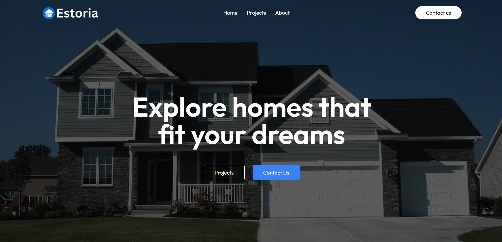
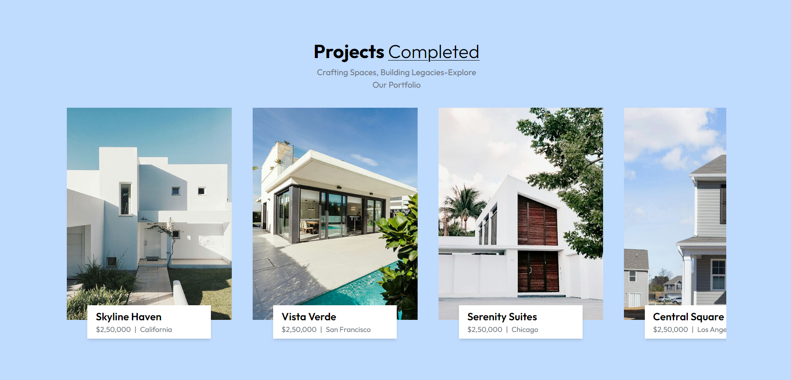
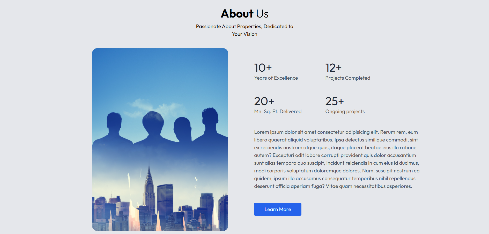
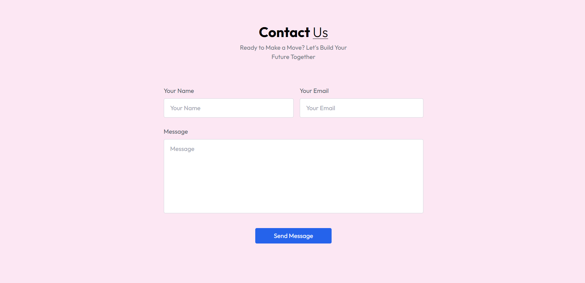

# **Estoria Real Estate**

Welcome to **Estoria**, a modern and responsive real estate web application that showcases stunning residential and commercial projects. Built with React, it delivers a seamless user experience with smooth animations, intuitive navigation, and clean design.

---

## **Table of Contents**

1. [Features](#features)  
2. [Technologies Used](#technologies-used)  
3. [Screenshots](#screenshots)  
4. [How to Run](#how-to-run)  
5. [Folder Structure](#folder-structure)  
6. [Future Enhancements](#future-enhancements)  
7. [Contributing](#contributing)  

---

## **Features**

✨ **Fully Responsive Design**  
- Optimized for mobile, tablet, and desktop devices.  

🚀 **Smooth Animations**  
- Powered by **Framer Motion** for an engaging user experience.  

🛠️ **Modular Components**  
- Well-structured React components for reusability and maintainability.  

🏢 **Interactive Sections**  
- **Header**: Hero section with call-to-action buttons.  
- **Projects**: Dynamic slider displaying project details.  
- **About Us**: Company overview showcasing achievements.  

🔔 **User Feedback**  
- Toast notifications with **React Toastify**.  

🖼️ **Easy Customization**  
- Centralized management for assets and data.

---

## **Technologies Used**

- **React.js**: Frontend library for building the UI.  
- **Framer Motion**: For animations and smooth transitions.  
- **React Toastify**: For interactive user notifications.  
- **Tailwind CSS**: Modern utility-first styling for a responsive design.  
- **CSS**: Custom styling for components.

---

## **Screenshots**

> Below are screenshots of the project. Paste your images in the designated sections.

### **1. Header Section**


### **2. Projects Section**


### **3. About Us Section**


### **4. Contact us Section**


---

## **How to Run**

Follow these steps to run the project locally:

1. **Clone the repository**  
   ```bash
   git clone https://github.com/yourusername/estoria.git
   cd estoria
   ```

2. **Install dependencies**  
   ```bash
   npm install
   ```

3. **Start the development server**  
   ```bash
   npm start
   ```

4. Open your browser and visit:  
   ```
   http://localhost:3000
   ```

---

## **Folder Structure**

Here’s a glimpse of the project structure:

```
/src
│-- assets/              # Images and assets
│-- components/          # Reusable components (Navbar, Header, About, Projects, etc.)
│-- App.jsx              # Root component
│-- index.css            # Main CSS file
│-- index.js             # Entry point for React
```

---

## **Future Enhancements**

1. **Dynamic Backend Integration**  
   - Fetch project details and images dynamically from a backend.

2. **Contact Form**  
   - Add a form for inquiries with proper validation and submission.

3. **Search and Filter Features**  
   - Allow users to filter projects based on location, price, or property type.

4. **Interactive Map**  
   - Integrate a map to display property locations.

---

## **Contributing**

Contributions are always welcome! 🎉  

If you’d like to contribute:  
1. Fork the repository.  
2. Create a new branch: `git checkout -b feature-name`.  
3. Make changes and test them.  
4. Push to your branch: `git push origin feature-name`.  
5. Submit a Pull Request.  

---

## **License**

This project is licensed under the MIT License.  

---

**Estoria** is your gateway to exploring dream properties with elegance and simplicity.  
Enjoy the experience! ✨  

